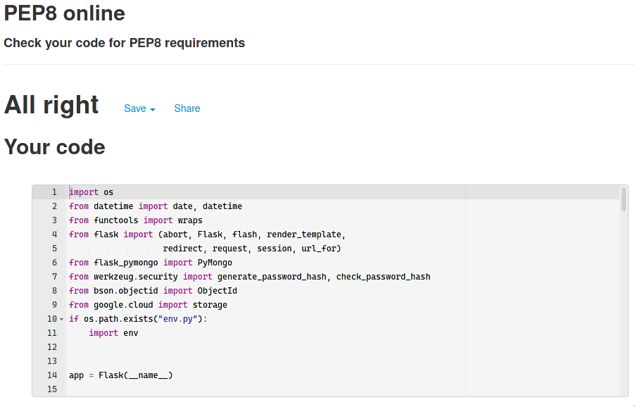

# Testing

## Code validation

The PEP8 validator returned no issues:

## Responsiveness

|              | **Responsive** |
| ------------ | :------------: |
| Desktop      |       ✅       |
| Laptop       |       ✅       |
| iPad         |       ✅       |
| iPhone 5     |       ✅       |
| iPhone 6/7/8 |       ✅       |
| iPhone X/XS  |       ✅       |

## Browser Compatibility

Browsers tested:

- Firefox
- Edge
- Edge Mobile

In this testing I found no issues with responsiveness or functionality.

## Testing User Stories

- As a user without an account, I want to register for an account.
  - By following the navbar's register link a user can register for an account
- As a signed out user, I want to log in.
  - By following the navbar's login link a user can log in.
- As a signed in user, I want to sign out.
  - By following the navbar's log out link a signed in user can log out.
- As a signed in user, I want to view my profile.
  - The navbar's profile link allows a logged in user to view all their posted brews.
- As a signed in user, I want to create a Brew post.
  - By clicking Add Brew a user is brought to the brew creation form.
- As a signed in user, I want to edit my Brew post.
  - On the related brew's page a user can click edit to be broght to the edit form.
- As a signed in user, I want to delete my Brew post.
  - On the related brew's page a user can click delete to delete the brew.
- As a signed in user, I want to comment on a brew post.
  - The comment form can be found on the related brew's page.
- As a signed in user, I want to delete my comment on a brew post.
  - The comment's poster can see a link to delete their comment
- As a user, I want to view a Brew post.
  - Any user can get to a brew's page by clicking it's card in the brews page or through the search functionality.
- As a user, I want to search for a Brew post.
  - The search bar in the header allows users to search for brews.

## Bugs

- During testing I discovered many issues with user authentication that were the result of insecure endpoints, I resolved this by creating a python decorator to mark all routes that required authentication

[return to README](README.md)
